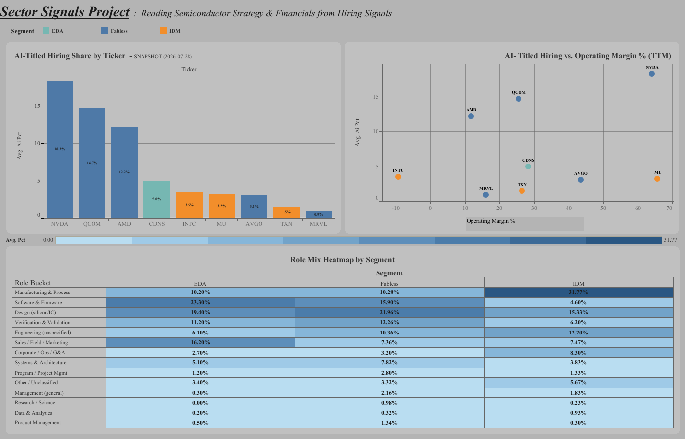

# Sector Signals

A data pipeline that scrapes and analyzes **hiring, financial, and patent signals** across major semiconductor companies to search for any trends as to where the industry is actually moving within the ever changing landscape of evolving AI technology— before it shows up in earnings. The hiring signal is delivered end-to-end as a live, interactive dashboard; financials and patents are built and stored, with cross-signal analysis as the next frontier.

**🔗 Live dashboard:** [Sector Signals on Tableau Public](https://public.tableau.com/app/profile/johann.kurzweil.de.boda4677/viz/sector_signals_dashboard/Dashboard1)



> Demoed on the semiconductor industry. The data model uses 9 companies across EDA, fabless, IDM, and foundry segments, all of which the hiring pipeline is currently active for. (SNPS and ANSS excluded in the meantime due to anti-bot ATS, TSM excluded due to difficulties surrounding foreign-filing)  

## Thesis

Given my experience consulting for Cadence — a semiconductor company in the EDA niche — I saw how strongly Cadence integrates AI into its workflows and operations. That made me curious how the constant evolution of AI is reshaping the semiconductor industry. Alongside this, I wanted to build upon my foundational data/business analytics and Management Information Systems skills to be able to learn more specific skills relevant to the field of Business Analytics alongside building the foundation for other skills that can be used for many other more specific fields such as Data Engineering. All of this I was able to achieve through guiding Claude and ChatGPT, in a fashion similar to a Project Manager, which served as the engine and tutor for this project.

The core question: **What do hiring patterns reveal about a company's strategy — geographic expansion, R&D focus, operational scale — before it shows up in financials and also when it does show up within the financials?** Public job postings are a free, structured, leading signal of corporate intent. This project collects, normalizes, stores, and analyzes them — alongside financials and patents — to find out.

## What's built

Three signals share one schema, keyed to a common `companies` table. The hiring signal is delivered end-to-end (pipeline → dashboard); financials and patents are loaded and query-ready.

### 1. Hiring signal — *dashboarded*

- **Multi-ATS scraper → normalized PostgreSQL store.** A single idempotent loader pulls open postings from **five different applicant-tracking systems** (each company uses a different one) and upserts them into a common schema. ~11,000 postings per daily snapshot; **556,411 rows** (as of writing) accumulated historically across daily runs.

- **Workday cap handling.** Bypasses Workday's undocumented 2,000-result limit via faceted fetching (re-querying per facet) with automatic facet detection.

- **Location normalization.** Real-world location strings are inconsistent across all five ATS's (order, casing, spelling, granularity). A 3-pass classifier (country-token matching → US state detection → curated city overrides, plus accent-folding and multi-site handling) resolves **477 distinct raw formats to 100% country/region coverage** (~87% to a specific country; the rest transparently flagged as multi-site) as to which the creation of was greatly accelerated via feeding the Data to Claude to do the analysis and create the classifiers.

- **Role classifier.** A keyword classifier assigns each posting to one of **13 role buckets** (the native ATS `category` field was unusable — five of nine companies had zero coverage, and populated ones used inconsistent schemes). ~80% of postings land in a specific function, catch-all buckets ("Engineering (unspecified)", "Management (general)") are used instead of forced guesses. Creation of classifier in same manner as location normalization

- **Daily automation.** A GitHub Actions cron runs the scrape every morning and publishes pre-aggregated views to a Google Sheet that the Tableau dashboard auto-refreshes from. A completeness guard blocks publishing if any company's scrape fails — a partial snapshot never reaches the dashboard. 

### 2. Financial signal — *in dashboard*

- **Two-tier sourcing: yfinance ingest, EDGAR source of record.** `load_financials.py` seeds financials from yfinance (fast, all tickers in one call); `edgar_backfill.py` then deletes and reloads US-listed tickers directly from the **SEC EDGAR Company Facts API** (primary 10-Q/10-K XBRL data). yfinance remains only for TSM (foreign filer, files 20-F) for possible future work to implement TSM into database. Any US figure on the dashboard is EDGAR-sourced.

- **Correct quarterly extraction.** 10-Ks report only the full fiscal year, never a standalone Q4 — so Q4 is derived as *(full-year − 9-month YTD)*, matched on shared fiscal-year start date. Discrete quarterly and cumulative-YTD facts are distinguished by period length, not filing label.

- **XBRL concept-collision handling.** Companies tag the same line item under different XBRL concepts across filings (e.g. Cadence files quarterly R&D under one concept and the 10-K annual under a sibling). Candidate concepts are tried in priority order — the primary is used, siblings only fill gaps.

### 3. Patent signal — *loaded, analysis pending*

- **61,519 patents (2021–2025) across all 12 companies**, from PatentsView bulk data.

- **Audited exact-match assignee attribution.** Patent assignee names are messy — one company appears under dozens of variants, subsidiaries, and outright typos. Rather than fuzzy-match (which silently drops or misattributes), every mapped organization name was confirmed against the source data and hand-curated in same manner as classifiers: Avago entities rolled into AVGO post-merger, deliberate inclusion of real typos ("Micron Technology, lnc." with a lowercase L; a garbled "MTAIWANANUFACTURING" for TSM), and rejection of the "intel" substring (16k+ false positives like "AT&T Intellectual Property"). The result is 100% auditable attribution rather than a fuzzy approximation.

## The dashboard

An interactive Tableau Public dashboard built on the live pipeline (Neon PostgreSQL → Google Sheet → Tableau, 24-hour auto-refresh). Three cross-filtered tiles — click a company in one and the others reorient to it:

- **AI-titled hiring share by ticker** — ranked bar, colored by segment.
- **Hiring vs. financials** — scatter with a viewer-controlled x-axis (swap between operating margin, R&D intensity, and posting volume).
- **Role-mix heatmap by segment** — role concentration across segments, sorted by the roles that most distinguish the business models.

Titles self-date from the data, so the dashboard always states its own as-of snapshot. 

Two interaction layers: 
   clicking a company **filters** the other views to it, and clicking one or more segments in the legend **highlights** them across all three views at once — so any two business models can be compared side by side without losing the rest for context.

### Selected findings

> **On the scope of these findings.** They come from a single daily snapshot across nine companies, and they're broad on purpose — directional rather than statistical. The goal of this build was to make the *question* askable every day, not to land a final answer. What exists now is the canvas — a pipeline that adds a row of history every morning — and the sharper questions (who started hiring for what, and when) only become answerable as that history accumulates. This is a major milestone in the project, not its endpoint.

- **Business structure, not financial ratios, predicts hiring tilt.** AI-titled hiring share shows no correlation with operating margin or R&D intensity — but role mix cleanly separates the segments.
- **Segment membership alone doesn't predict AI tilt.** The top three AI-titled hirers are all fabless (NVIDIA, Qualcomm, AMD) — but so is the *lowest* (Marvell). Position in the value chain matters more than the segment label.
- **Manufacturing hiring splits the IDMs out; software/design splits fabless & EDA out.** The role-mix heatmap makes each business model legible from its hiring alone.

> **A note on the financial axis:** it's a trailing-twelve-month (TTM) operating margin. TTM can differ sharply from a single headline quarter — e.g. Intel's TTM lands near −9% because it blends two heavy-loss quarters with two profitable mid-2025 ones, even though its most recent quarter alone was ≈ −23%. Every figure on the dashboard is sourced from primary SEC filings via EDGAR.

### Notebook analysis: hiring geography

Explored in `analysis/02_hiring_geography.ipynb` (not on the dashboard — the geographic story added less than the hiring/financial/role-mix cuts). Highlights:

- **Asia outweighs North America in open postings** (≈5,100 vs ≈3,800) even across these US-listed firms — the industry's hiring footprint is substantially Asia.
- **Micron is the most regionally concentrated** (~74% of postings in Asia)
- **Broadcom the most US-centric** (~68% North America)
- **Intel the most globally distributed.**
- **NVIDIA is the Middle East outlier** (~17% of postings, ~3× any peer) — its Israel R&D base, originating from the 2020 Mellanox acquisition (verified against public reporting).

## Engineering highlights

The parts that took real problem-solving:

- **Two-layer ATS reality.** A company's front-end careers portal is often a different vendor from its back-end ATS (e.g. AMD runs a Jibe front-end over an iCIMS back-end). The scraper targets whatever endpoint actually serves the data, per company.

- **Workday's 2,000-job cap**, bypassed via facet pagination.

- **EDGAR quarterly derivation** (Q4 = full-year − 9-month YTD) 

- **XBRL concept-collision resolution** — non-obvious gotchas in turning raw SEC filings into a clean quarterly series.

- **Patent assignee attribution** by audited exact-match rather than fuzzy matching — auditable over approximate.

- **Two-shape publish design.** The daily job publishes two pre-aggregated frames — one row per ticker (wide, for the bar/scatter) and one row per ticker-per-role-bucket (long, for the heatmap) — so Tableau reads clean, purpose-built tables rather than aggregating raw data live.

## Stack

- **Language:** Python 3.13

- **ETL / analysis:** pandas, SQLAlchemy + psycopg2, requests, BeautifulSoup, gspread, google-auth, yfinance, python-dotenv

- **Database:** PostgreSQL (Neon, cloud-hosted)

- **Automation:** GitHub Actions (daily cron)

- **Notebooks / viz:** Jupyter, matplotlib, seaborn; **Tableau Public** for the interactive dashboard

## Data sources

| Signal | Source |
|--------|--------|
| Hiring | Public careers sites via each company's ATS (Workday, Jibe, Eightfold, Oracle HCM, TalentBrew) |
| Financials | SEC EDGAR Company Facts API (source of record); yfinance (ingest / TSM) |
| Patents | PatentsView bulk data |

**Hiring by ATS:**

| ATS | Companies |
|-----|-----------|
| Workday = NVDA, CDNS, MRVL, INTC, AVGO |
| Jibe = AMD |
| Eightfold = QCOM, MU |
| Oracle HCM = TXN |
| TalentBrew = SNPS + ANSS *(seeded but disabled — endpoint is anti-bot gated)* |

## Setup

1. Clone the repo, create a virtual environment, and install dependencies:
   ```bash
   pip install -r requirements.txt
   ```
2. Copy `.env.example` to `.env` and fill in your PostgreSQL credentials (and a `SEC_USER_AGENT_EMAIL` for EDGAR fair-use).
3. Create the schema:
   ```bash
   psql "$DATABASE_URL" -f sql/schema.sql
   ```
4. Run the loaders:
   ```bash
   python etl/load_hiring.py        # hiring snapshot
   python etl/load_financials.py    # financials (yfinance ingest)
   python etl/edgar_backfill.py     # overwrite US tickers with EDGAR data
   ```

## Repo structure

```
etl/          Scrapers, loaders, and the daily publish script

              (load_hiring.py, load_financials.py, edgar_backfill.py,
               load_patents.py, assignee_mapping.py, publish_sheets.py, detect_ats.py)

analysis/     Jupyter notebooks 

              (hiring snapshot, geography, role category,
              financials, cross-signal)

sql/          schema.sql — database schema

.github/      GitHub Actions workflow (daily scrape + publish)

requirements.txt

.env.example
```

## Roadmap

The pipeline compounds: every daily run adds history that didn't exist before, something that can be built further upon.

**Possible Next Steps:**
- **Time-series / snapshot deltas** — how hiring books change over time. The highest-value signal, and the one that only accrues by waiting: a quarter of daily snapshots turns "who is hiring for AI" into "who *started*, and when."
- **Cross-signal analysis** — relate hiring tilt to patent output and financial performance (all three signals are loaded; this is the analysis the schema was designed for).
- **Patents on the dashboard** — surface the 61k-patent dataset alongside hiring and financials.
- **Snapshot retention policy** — daily snapshots grow storage steadily; thinning older snapshots to weekly preserves the trend signal while keeping the footprint sustainable on a free-tier database.
- **Lightweight AI insight layer** — an LLM-generated plain-English readout of what changed.

## Design notes

The schema is **architected for multiple signals** — hiring, financials, stock prices, and patents all key to a shared `companies` table. The loader is **config-driven by company + ATS mapping**, so extending the company list is mostly configuration rather than new code. Adapting to a non-semiconductor sector would still require wiring each new company's ATS and classification terms — so it's built *for* extensibility, not yet a plug-and-play multi-sector tool.